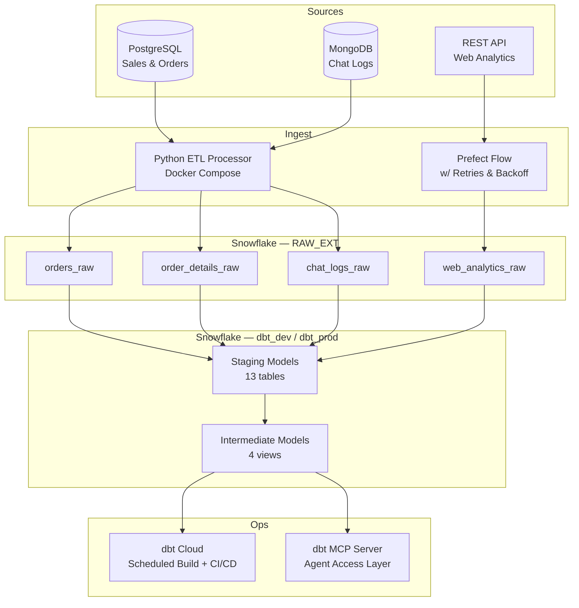

# Adventure Works Data Platform

A production-style, end-to-end data pipeline ingesting from three source systems into Snowflake, transforming with dbt, orchestrating with Prefect, validating with automated tests, and exposing models to AI agents via a dbt MCP server.

---

## Architecture



---

## Problem Statement

Adventure Works lacked end-to-end visibility into the customer journey. Sales data lived in PostgreSQL, customer support conversations in MongoDB, and website behavior was entirely untracked. Analysts had no reliable way to connect browsing patterns to purchase outcomes, and there were no automated checks to catch stale or malformed data before it reached dashboards.

This project builds the full data platform: a multi-source ingestion layer, a transformation layer with testable, documented models, and an agent-accessible interface that lets AI tools answer business questions directly from the warehouse.

---

## Tech Stack

| Tool | Role | Why This Tool |
|---|---|---|
| **PostgreSQL** | Sales source | Simulates a standard transactional OLTP system; well-understood schema for orders and products |
| **MongoDB** | Chat log source | Document store for semi-structured support conversations; tests JSON-to-warehouse extraction patterns |
| **Snowflake** | Cloud data warehouse | Separation of compute and storage prevents idle credit burn; native semi-structured (VARIANT) support handles MongoDB JSON; internal stages simplify the extract-stage-load pattern without an external file store |
| **Python + Docker** | ETL processor | Stateless, containerized ETL makes the extraction layer portable and reproducible; watermark strategy ensures incremental-only loads without duplicates |
| **dbt** | Transformation layer | Version-controlled SQL models with built-in test framework; staging→intermediate layering creates reusable building blocks rather than one-off queries; YAML-driven docs make models machine-readable |
| **Prefect** | Orchestration | Native retry and backoff for API rate limits (429s); task-level observability shows exactly which step failed without digging through logs; deployable inside Docker Compose with the same `.env` as everything else |
| **dbt Cloud** | CI/CD + scheduling | Automated `dbt build` on every pull request catches breaking changes before they reach production; daily scheduled jobs keep the warehouse fresh without manual intervention |
| **dbt MCP Server** | Agent access layer | Exposes compiled SQL, model lineage, and column descriptions to any MCP-compatible AI agent; enables natural-language data exploration without giving agents direct warehouse credentials |

---

## Data Flow

```
1. SOURCE EXTRACTION
   PostgreSQL (sales, order_details) ──► Python Processor ──► Snowflake Internal Stage
   MongoDB (chat_logs)               ──► Python Processor ──► Snowflake Internal Stage
   REST API (clickstream events)     ──► Prefect Flow     ──► Snowflake Internal Stage

2. LOAD (COPY INTO)
   Each internal stage ──► RAW_EXT.{orders_raw, order_details_raw, chat_logs_raw, web_analytics_raw}
   Stage files are removed after successful load (no orphaned data)

3. TRANSFORM (dbt)
   RAW_EXT tables ──► staging models (type casting, null handling, UTC normalization)
                  ──► intermediate models (joins, enrichment, business-level grain)

4. VALIDATE (dbt tests)
   not_null, accepted_values, relationships, uniqueness, custom SQL tests
   Source freshness checks on web_analytics_raw (warn: 12h, error: 24h)

5. DELIVER
   dbt Cloud scheduled job (daily) ──► dbt_prod schema
   dbt Cloud CI job (every PR)     ──► validates before merge
   dbt MCP Server                  ──► AI agents can query model metadata and compiled SQL
```

---

## Key Metrics

| Metric | Query | Value |
|---|---|---|
| Total sales orders | `SELECT COUNT(*) FROM dbt_dev.stg_ecom__sales_orders;` | 38065 |
| Total customers | `SELECT COUNT(*) FROM dbt_dev.stg_adventure_db__customers;` | 19119 |
| Total chat logs | `SELECT COUNT(*) FROM dbt_dev.stg_real_time__chat_logs;` | 134 |
| Total web analytics events | `SELECT COUNT(*) FROM raw_ext.web_analytics_raw;` | 12107 |
| Date range of web events | `SELECT MIN(event_timestamp), MAX(event_timestamp) FROM raw_ext.web_analytics_raw;` | 04-10-2026 to 04-20-2026 |
| dbt models | 18 (13 staging, 5 intermediate) | — |
| dbt custom tests | 6 SQL test files + inline YAML tests | — |
| Data sources integrated | 3 (PostgreSQL, MongoDB, REST API) | — |
| Models exposed via MCP | 18 (confirmed via demo_output.log) | — |

---

## Repository Structure

```
.
├── compose.yml                  # Full Docker Compose stack (all 9 services)
├── .env.sample                  # Environment variable template
├── processor/                   # Python ETL microservice (Milestone 1)
│   ├── etl/extract.py           # Watermark-based extraction from PG + Mongo
│   ├── etl/load.py              # Stage upload, COPY INTO, REMOVE
│   └── main.py                  # Orchestration loop
├── prefect/                     # Prefect orchestration (Milestone 2)
│   ├── flows/web_analytics_flow.py  # 7-task incremental API ingest flow
│   ├── prd.md                   # Product requirements doc (written before building)
│   └── agent_log.md             # AI agent interaction log
├── dbt/
│   ├── models-m1/               # Milestone 1 staging + intermediate models
│   ├── models-m2/               # Milestone 2 web analytics models
│   ├── tests/                   # 6 custom SQL data quality tests
│   └── agent_access_reflection.md  # Reflection on agent-accessible data design
├── mcp/
│   ├── demo_client.py           # Python MCP client demo (Milestone 3)
│   └── demo_output.log          # Recorded agent interaction output
└── sql/
    ├── create_raw_tables.sql    # DDL for RAW_EXT tables
    └── check_data_flow_queries.sql
```

---

## Setup and Run

### Prerequisites

- Docker Desktop
- A Snowflake account with a role, warehouse, and database provisioned
- `uv` ([install](https://docs.astral.sh/uv/getting-started/installation/)) for local Python tooling

### 1. Configure Environment

```bash
cp .env.sample .env.dev
```

Edit `.env.dev` and fill in your Snowflake credentials:

```bash
SNOWFLAKE_USER=your_username
SNOWFLAKE_PASSWORD=your_password
SNOWFLAKE_ACCOUNT=your_account_identifier
SNOWFLAKE_WAREHOUSE=your_warehouse
SNOWFLAKE_DATABASE=your_database
SNOWFLAKE_ROLE=your_role          # Required — omitting this breaks session context
```

The MongoDB and PostgreSQL values in `.env.sample` are pre-configured for Docker Compose and do not need to change.

### 2. Create Snowflake Objects

Run the DDL in a Snowflake worksheet before starting the stack:

```sql
-- Create schema and raw tables
-- See sql/create_raw_tables.sql for the full DDL

-- Create internal stages
-- See prefect/snowflake_objects.sql for stage DDL
```

Verify:

```sql
SHOW TABLES IN SCHEMA RAW_EXT;
SHOW STAGES IN SCHEMA RAW_EXT;
```

### 3. Start the Full Stack

```bash
docker compose up -d
```

Services started:

| Service | Port | Purpose |
|---|---|---|
| `postgres` | 5432 | Sales source database |
| `mongo` | 27017 | Chat log source database |
| `generator` | — | Continuously generates Adventure Works data |
| `processor` | — | Extracts, stages, and loads to Snowflake |
| `prefect-server` | 4200 | Prefect API and UI |
| `prefect-worker` | — | Executes the web analytics flow |
| `web-analytics-flow` | — | Deploys and schedules the Prefect flow |
| `dbt-mcp` | 8000 | dbt MCP server for agent access |

### 4. Verify Data Is Flowing

```bash
# Watch processor logs
docker compose logs -f processor

# Watch Prefect flow logs
docker compose logs -f web-analytics-flow
```

Then confirm data landed in Snowflake:

```sql
SELECT COUNT(*) FROM raw_ext.orders_raw;
SELECT COUNT(*) FROM raw_ext.chat_logs_raw;
SELECT COUNT(*) FROM raw_ext.web_analytics_raw;
```

### 5. Run dbt Transformations

```bash
cd dbt
dbt build
```

Or scope to just the new models:

```bash
dbt build --select stg_web_analytics int_web_analytics_with_customers
```

### 6. Run Data Quality Tests

```bash
dbt test
dbt source freshness
```

### 7. Access the Prefect UI

Open `http://localhost:4200` to see scheduled flow runs, task-level logs, and retry history.

### 8. Run the MCP Agent Demo

With `dbt-mcp` running:

```bash
cd mcp
uv sync
uv run python demo_client.py
# Output saved to mcp/demo_output.log
```

---

## Data Quality

Three layers of validation protect the pipeline:

**Source freshness** — dbt checks the most recent `event_timestamp` in `web_analytics_raw`. A gap over 12 hours triggers a warning; over 24 hours triggers an error. This catches Prefect flow failures before analysts notice stale dashboards.

**Generic tests (YAML)** — Every key column in the web analytics source and staging models is covered:
- `not_null` on `customer_id`, `product_id`, `session_id`, `event_timestamp`
- `accepted_values` on `event_type` (`page_view`, `click`, `add_to_cart`, `purchase`)
- `relationships` linking `customer_id` back to `stg_adventure_db__customers`

**Custom SQL tests** — Six tests in `dbt/tests/` enforce business rules that generic tests can't express, including minimum row count checks, inventory sanity checks, and a freshness threshold query.

---

## Agent Access Layer

The dbt MCP server (Milestone 3) exposes all 18 dbt models to any MCP-compatible AI agent. An agent can:

- List all models and read their descriptions
- Retrieve column-level metadata (types, tests, business meaning)
- Compile the fully-resolved SQL for any model
- Trace lineage upstream to sources and downstream to dependents

This was only useful after upgrading model descriptions to be agent-friendly — explicitly stating grain, join keys, and nullable fields so the agent could reason about which models to query and how to join them. See [`dbt/agent_access_reflection.md`](dbt/agent_access_reflection.md) for a full discussion of what worked and what didn't.

---

## What I Learned

**Writing specs before prompting pays off.** The PRD I wrote for the Prefect flow (Task 1 in Milestone 2) made a measurable difference in the agent's output quality. A vague prompt produced skeleton code with PostgreSQL-style `INSERT` statements where Snowflake `COPY INTO` was needed. A spec with explicit acceptance criteria — including the exact Snowflake command syntax and the stage cleanup requirement — produced something close to production-ready on the second iteration. Estimated time saved: 1.5 hours of agent-assisted work versus 3–5 hours of solo implementation.

**Documentation is infrastructure when agents are consumers.** The MCP demo made this concrete. An agent reading `description: "Staging model for orders"` produces useless or wrong SQL. An agent reading a description that states the grain, the join key, and the timezone of the timestamp column produces accurate queries. Writing for agents forced me to be precise about things I'd left vague when writing only for humans.

**Watermark strategy is fragile at the edges.** Deriving the new watermark from `MAX(event_timestamp)` in the pulled data — rather than the system clock — keeps the timeline consistent when the generator and processor run at different rates. But it means a dry cycle (zero new records) doesn't advance the watermark, which is correct behavior that's easy to misread as a bug during testing.

**Data quality is cheap to add and expensive to skip.** Adding `not_null` and `relationships` tests to the web analytics source took under 30 minutes. The `relationships` test immediately flagged that some generated customer IDs fell outside the customer dimension's range — a data contract issue that would have silently produced null joins in every downstream model if left uncaught.

---

## Agent Interaction Log

See [`prefect/agent_log.md`](prefect/agent_log.md) for the full record of how the Prefect flow was built with AI assistance: what worked, what the agent got wrong, how I caught it, and what I'd do differently.

---

## Milestones

| Milestone | Focus | Key Deliverables |
|---|---|---|
| 1 | Multi-source ETL | Python processor, Docker Compose stack, dbt staging + intermediate models, Snowsight dashboard |
| 2 | Orchestration + data quality | Prefect flow, web analytics source, dbt tests + source freshness, dbt Cloud CI/CD |
| 3 | Agent access layer | dbt MCP server, agent-friendly model docs, MCP demo client, architecture reflection |