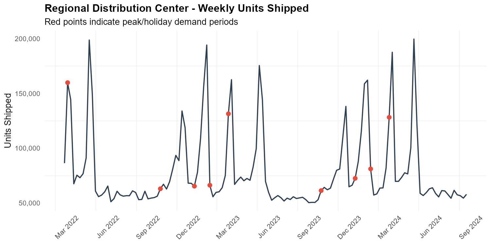
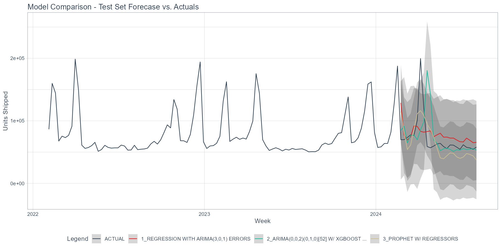
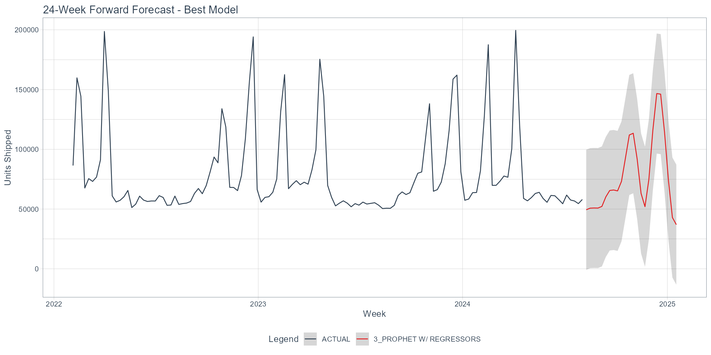

# Weekly Demand Forecasting Pipeline
### Regional Distribution Center — R · modeltime · tidymodels · vetiver · Docker

---

## Overview

Regional distribution centers operate on thin margins where forecast accuracy directly
determines operational cost. Understocking a peak holiday week means missed shipments
and broken SLAs. Overstocking means excess labor, overtime, and carrying costs that
erode profitability.

This project builds a production-grade weekly demand forecasting pipeline that predicts
units shipped 24 weeks into the future, with particular emphasis on the sharp Q4 holiday
spikes that dominate annual variance. Three candidate time series models are compared
against a held-out test period, and the best-performing model is deployed as a
containerized REST API that an operations team could call directly for staffing and
inventory planning decisions.

---

## Dataset

~130 weekly observations from a regional distribution center spanning early 2022 through
mid-2024. The forecast target is `weekly_units` — total units shipped each week.
External regressors include a binary peak/holiday period flag, regional average
temperature, and a transportation cost index.

**Key patterns identified during EDA:**

- Demand spikes 2.7–3.2× above baseline during Q4 holiday periods — consistent
  amplitude ratio across all three years confirms multiplicative seasonality
- The `is_peak_period` flag is a **one-week leading indicator**: it fires the week
  *before* shipment volume peaks (avg 92k flagged week vs. 101k the following week),
  consistent with how distribution center demand actually flows
- No meaningful year-over-year trend — volume is stable across 2022–2024, making
  seasonal-naive imputation a reliable strategy for future regressor values
- ACF analysis shows strong lag-1 autocorrelation (~0.55) and a classic AR(1)/AR(2)
  signature in the PACF, but no statistically significant lag-52 spike — the series
  is too short (~2.5 annual cycles) for the ACF to detect annual seasonality
  statistically, even though it is visually clear



---

## Modeling Approach

Built using the [`modeltime`](https://business-science.github.io/modeltime/) package
within the `tidymodels` framework. All three models share a single preprocessing
recipe and are wrapped in `workflow()` objects for compatibility with `vetiver`
deployment.

**Train/test split:** The most recent 24 weeks are held out as the test set using
`timetk::time_series_split()` with `cumulative = TRUE`. Random splitting is strictly
avoided — all training observations precede all test observations chronologically.

**Shared recipe:**
```r
weekly_units ~ date + is_peak_period + avg_temp_f + transport_cost_idx
```
`price_index` and `local_unemp_rate` are excluded — both are slow-moving
macroeconomic variables unlikely to explain week-to-week variance at a single facility.

**Three candidate models:**

| Model | Engine | Key Design Decision |
|---|---|---|
| Auto-ARIMA | `auto_arima` | `seasonal_period = 52`; regressors enter as linear covariates |
| Boosted ARIMA | `auto_arima_xgboost` | ARIMA seasonal backbone + XGBoost on residuals; `learn_rate = 0.015` to prevent overfitting on small dataset |
| Prophet | `prophet` | `seasonality_yearly = TRUE`; Fourier seasonality better suited to short series than ARIMA's lag-based approach |

---

## Results

Prophet won by a meaningful margin on RMSE, though all three models struggled with the
sharp holiday spikes — an honest reflection of how difficult multiplicative seasonality
is to capture on a short series.

| Model | RMSE | MAE | R² |
|---|---|---|---|
| **Prophet** ✓ | **25,365** | **19,782** | **0.414** |
| Auto-ARIMA | 30,633 | 19,911 | 0.060 |
| Boosted ARIMA | 39,680 | 20,292 | 0.024 |

The R² values are low across the board, which reflects a genuine challenge in the data
rather than a modeling failure: with only ~2.5 annual cycles and sharp multiplicative
spikes, none of the classical modeltime engines had enough history to reliably learn the
full seasonal structure. Prophet's Fourier seasonality representation gave it a
meaningful edge over the ARIMA-family models, which rely more heavily on the
autocorrelation structure that a short series can't establish cleanly.

The ARIMA and Boosted ARIMA models also ran with additive seasonality — the correct
setting (`seasonality_mode = "multiplicative"`) is not exposed by this version of
modeltime at either the `prophet_reg()` or `set_engine()` layer, which likely
contributed to their underperformance on holiday peaks.





---

## AI Collaboration Strategy

This project was built using Claude as a collaborative pair programmer throughout —
not as an autonomous agent handed a spec and left to run. The distinction mattered
in practice.

During EDA, I used AI to help interpret diagnostic outputs I hadn't seen before (ACF/PACF
plots, seasonal decomposition facets) while doing the actual investigation myself. When
the ACF showed no lag-52 spike, I asked AI to explain what that meant for my modeling
choices rather than just accepting a model recommendation. When the multiplicative
seasonality ratio came back consistent at 2.7–3.2× across all three years, I asked AI
to explain the log-transform tradeoff before deciding against it — the decision to keep
metrics comparable across models was mine, made with understanding of the consequences.

The most useful pattern was using AI to explain *why* something was the right approach
before writing the code for it. When `seasonality_mode = "multiplicative"` threw two
different errors at two different layers, I debugged each one with AI rather than
accepting the first suggested fix, which is how I learned that modeltime was intercepting
the argument internally. That kind of back-and-forth — where I pushed back, investigated,
and ultimately made a documented decision — is what made the AI collaboration genuinely
productive rather than just fast.

Where AI drove more heavily: boilerplate workflow code, `ggsave()` calls, and the
`future_tbl` regressor population pattern (seasonal-naive join + LOCF). Where I owned
the decisions: which regressors to include and exclude, the multiplicative seasonality
handling strategy, the choice to keep metrics comparable across models rather than
log-transforming, and all interpretation of diagnostic outputs.

---

## How to Run

**Requirements:** R ≥ 4.2, Docker

**Install R dependencies:**
```r
install.packages(c("tidyverse", "tidymodels", "modeltime", "timetk",
                   "lubridate", "vetiver", "pins", "httr", "jsonlite"))
```

**Run the pipeline:**
```r
source("forecast_pipeline.R")
```
Run top-to-bottom. Phases 2 and 3 (EDA and modeling) complete automatically.
Phase 4 requires Docker to be running for the local API test.

**Build and run the Docker API:**
```bash
docker build -t forecast-api .
docker run -p 8000:8000 forecast-api
```
The `/predict` endpoint accepts a row of feature data (all columns except
`weekly_units`) and returns a point forecast. Interactive API docs available
at `http://127.0.0.1:8000/__docs__/`.

---

## What I Learned

The most important thing this project taught me is that understanding your data
before fitting models is not optional — it changes the models you build. Discovering
that `is_peak_period` was a leading indicator rather than a contemporaneous flag,
and that the series had consistent multiplicative seasonality, were findings that
directly shaped modeling decisions. Neither would have surfaced if I had skipped
straight to fitting.

The second thing was a more grounded understanding of what "short" means in time
series. 130 weeks of data sounds like a lot until you realize it's only 2.5 annual
cycles — not enough for classical ARIMA to reliably estimate a 52-period seasonal
structure from autocorrelation alone. Prophet's Fourier approach sidesteps this
limitation, which is why it won despite the challenging data. On a longer series,
the ARIMA-family models would likely have been more competitive.

The AI-assisted workflow was genuinely effective for learning a new framework quickly.
The key was staying in the driver's seat — using AI to explain and suggest, but
owning every decision and being able to defend every line.

---

## Stack

`R` · `tidyverse` · `tidymodels` · `modeltime` · `timetk` · `prophet` · `vetiver` · `pins` · `Docker`